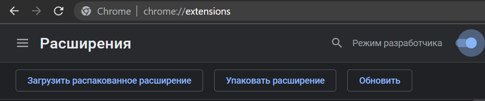
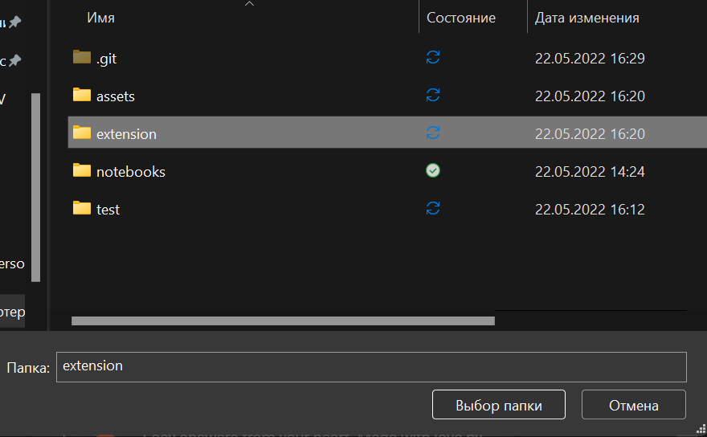
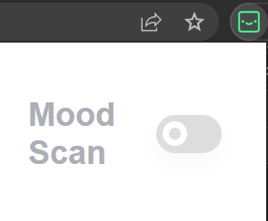
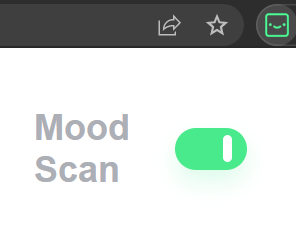
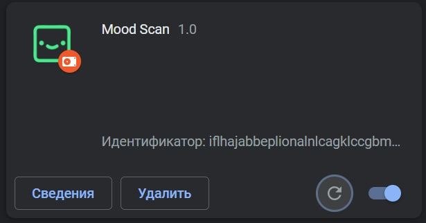

<a rel="license" href="https://github.com/timsmr/ICT.HACK-IV/blob/main/LICENSE"></a>

# ICT.HACK-IV | __Mood Scan__  


## Описание

__Mood Scan__ - проект, который направлен на помощь нейроотличным детям, испытывающим проблемы с пониманием эмоций. Проект помогает детям различать эмоции на видеоконтенте. Решение представляет собой расширения для браузера, выделяющее лица на видео и подписывающее эмоции. Проект был разработан в рамках ICT.HACK-IV, который проводился  на базе Университета ИТМО города Санкт-Петербурга 20-22 мая 2022 года.

> __Нейроотличные люди__ - люди с генетической изменчивостью в строении мозга относительно коммуникаций, особенности обучения, фокусировки внимания в непатологическом смысле (т.е. является не расстройством или заболеванием, а альтернативным вариантом нормы).

## Установка

1. Скачайте zip-архив репозитория или склонируйте его.
2. Зайдите в Google Chrome и наберите в строке поиска `chrome://extensions/`
3. Включите режим разработчика, как показано на картинке.
4. У вас появится кнопка *Загрузить распакованное расширение*  

  

5. Выберите папку `extension` из распакованного расширения, как показано на скриншоте<br>

6. Расширение должно успешно загрузиться!

## Использование

После добавленного расширения, откройте и включите его, как показано на скриншоте:

 

Зайдите на страницу с интересующим вас видео.

>*UPD: На данный момент работает только с видео, загруженным на localhost*<br>
__ШАГ 0:__ В репозитории уже лежит тестовое видео, на котором вы можете проверить работу расширения. Однако, вы можете положить ваше видео в папку `./test/`. Название видео должно быть `video.mp4`<br><br>
>[Cсылка на более репрезентативное видео](https://drive.google.com/file/d/1NiKjFc38UYZjwvs4reI1yd6feBvhVTTy/view?usp=sharing)<br><br>
__ШАГ 1:__ Установить Python 2 или 3 версии.<br>
__ШАГ 2:__ В консоли перейдите в корень репозитория и пропишите следующую команду:<br>
>
>```python
>>python ./test/test.py
>```
>
>__ШАГ 3:__ В адресной строке прописать `localhost:8000/test/test.html`<br>
>__ШАГ 4:__ Восхищаться расширением!  
>UPD: Если расширение не работает, перейдите по адресу `chrome://extensions/` и нажмите на кнопку, как показано на картинке<br>
>

## Заключение

Проект был разработан студентами ФИКТ Университета ИТМО:<br>

* [Смирнов Тимур](https://github.com/timsmr)
* [Костень Анна](https://github.com/aknsntn)
* [Таиров Захар](https://github.com/Shaorrran)

Если вам интересен данный проект, мы открыты к предложениям. Будем рады принять PR или иные предложения, канал обратной связи: `smrtim17@gmail.com`

__🏆 Данный проект занял 1 место в общем зачете на ICT.HACK-IV__